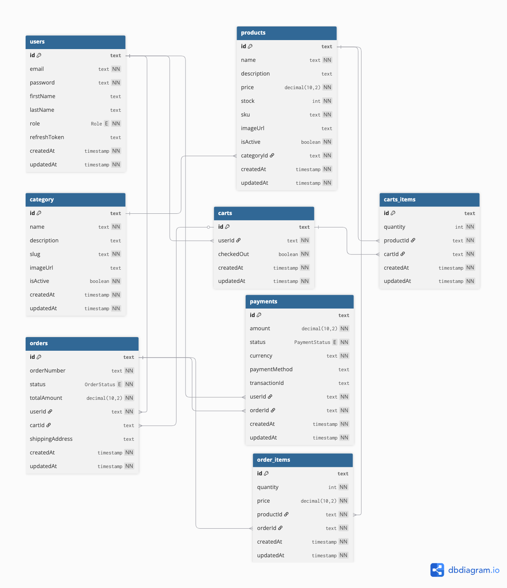

<h1 align="center">🛍️ EcompLiy</h1>

<h3 align="center">Full-Stack E-Commerce Platform</h3>

<p align="center">
  <b>Project Progress Summary</b><br/>
  📅 <b>Last Updated:</b> February 28, 2026<br/>
  ⏱️ <b>Timestamp:</b> 2026-02-28T12:00:00Z
</p>

<p align="center">
  
  
  
  
  
</p>

<hr/>

<h2>🚀 Project Overview</h2>

<p>
  <strong>EcompLiy</strong> is a modern full-stack e-commerce platform built with a scalable architecture. The project uses a monorepo-style setup with separate backend and frontend applications.
</p>

<ul>
  <li><b>Backend:</b> NestJS + PostgreSQL</li>
  <li><b>Frontend:</b> React 19 + Vite 7</li>
  <li><b>ORM:</b> Prisma with PostgreSQL adapter</li>
  <li><b>Authentication:</b> JWT (Access + Refresh tokens)</li>
</ul>

---

<h2>🗄️ Database Schema</h2>

<p>The database diagram below illustrates the relationships between all models:</p>

<p align="center">
  
</p>

---

<h3>Database Models</h3>

| Model               | Description                                                           |
| ------------------- | --------------------------------------------------------------------- |
| 👤 <b>User</b>      | User accounts with roles (USER, ADMIN), email, password, profile info |
| 📦 <b>Product</b>   | Product catalog with SKU, pricing, stock, images                      |
| 🗂️ <b>Category</b>  | Product categories with slug for SEO                                  |
| 🛒 <b>Cart</b>      | Shopping cart per user                                                |
| 🛒 <b>CartItem</b>  | Items in cart (unique per cart + product)                             |
| 📦 <b>Order</b>     | Customer orders with status tracking                                  |
| 📦 <b>OrderItem</b> | Individual items in an order                                          |
| 💳 <b>Payment</b>   | Payment records with transaction tracking                             |

<h4>Order Status Flow</h4>
<p>
  <code>PENDING</code> → <code>PROCESSING</code> → <code>SHIPPED</code> → <code>DELIVERED</code> | <code>CANCELLED</code>
</p>

<h4>Payment Status</h4>
<p>
  <code>PENDING</code> | <code>COMPLETED</code> | <code>FAILED</code> | <code>REFUNDED</code>
</p>

---

<h2>📁 Project Structure</h2>

<pre>
EcompLiy/
├── backend/                 # NestJS backend application
│   ├── src/
│   │   ├── common/          # Shared guards, decorators, interfaces
│   │   ├── modules/         # Feature modules (auth, users)
│   │   ├── prisma/          # Prisma service & module
│   │   └── main.ts          # Application entry point
│   ├── prisma/
│   │   └── schema.prisma    # Database schema
│   └── package.json
├── frontend/                # React frontend application
│   ├── src/
│   └── package.json
├── DB_Diagram.png           # Database ER diagram
└── package.json             # Root package with concurrent dev scripts
</pre>

---

<h2>🔧 Backend Development (NestJS)</h2>

<h3>Core Configuration</h3>
<ul>
  <li>Global API prefix: <code>/api/v1</code></li>
  <li>Environment-based port (default: 3000)</li>
  <li>Global error handling with Logger</li>
</ul>

<h3>✅ Authentication (Complete)</h3>

| Endpoint                           | Method | Description          | Auth Required      |
| ---------------------------------- | ------ | -------------------- | ------------------ |
| <code>/api/v1/auth/register</code> | POST   | Register new user    | ❌                 |
| <code>/api/v1/auth/login</code>    | POST   | Login user           | ❌                 |
| <code>/api/v1/auth/refresh</code>  | POST   | Refresh access token | ✅ (Refresh Token) |
| <code>/api/v1/auth/logout</code>   | POST   | Logout user          | ✅ (JWT)           |

<h4>Token Configuration</h4>
<ul>
  <li><b>Access Token:</b> 15 minutes expiry</li>
  <li><b>Refresh Token:</b> 7 days expiry</li>
  <li>Password hashing with bcrypt (12 salt rounds)</li>
</ul>

<h3>✅ Users Module (Complete)</h3>

| Endpoint                               | Method | Description                 | Auth Required | Roles       |
| -------------------------------------- | ------ | --------------------------- | ------------- | ----------- |
| <code>/api/v1/users/me</code>          | GET    | Get current user profile    | ✅            | USER, ADMIN |
| <code>/api/v1/users/me</code>          | PATCH  | Update current user profile | ✅            | USER, ADMIN |
| <code>/api/v1/users/me/password</code> | PATCH  | Change password             | ✅            | USER, ADMIN |
| <code>/api/v1/users/me</code>          | DELETE | Delete own account          | ✅            | USER, ADMIN |
| <code>/api/v1/users</code>             | GET    | Get all users               | ✅            | ADMIN       |
| <code>/api/v1/users/:id</code>         | GET    | Get user by ID              | ✅            | ADMIN       |
| <code>/api/v1/users/:id</code>         | DELETE | Delete user by ID           | ✅            | ADMIN       |

<h3>🗄️ Prisma Setup</h3>

<ul>
  <li>Custom PrismaService extending PrismaClient</li>
  <li>Uses <code>@prisma/adapter-pg</code></li>
  <li>Lifecycle hooks implemented</li>
  <li>Development-only <code>cleanDatabase()</code> utility</li>
</ul>

<h3>📦 Available Scripts</h3>

```bash
# Install all dependencies
npm install

# Install backend dependencies only
cd backend && npm install

# Install frontend dependencies only
cd frontend && npm install

# Development (runs both frontend and backend concurrently)
npm run dev

# Backend only
cd backend
npm run start:dev

# Frontend only
cd frontend
npm run dev
```

---

<h2>🎨 Frontend (React + Vite)</h2>

<ul>
  <li>React 19 with Vite 7</li>
  <li>Default template stage (no custom UI yet)</li>
</ul>

---

<h2>📊 Current Progress</h2>

<table>
  <tr>
    <td><b>Feature</b></td>
    <td><b>Status</b></td>
  </tr>
  <tr>
    <td>Project Setup</td>
    <td>✅ Complete</td>
  </tr>
  <tr>
    <td>Database Schema</td>
    <td>✅ Complete</td>
  </tr>
  <tr>
    <td>Prisma Setup</td>
    <td>✅ Configured & Migrated</td>
  </tr>
  <tr>
    <td>JWT Authentication</td>
    <td>✅ Complete (Register, Login, Refresh, Logout)</td>
  </tr>
  <tr>
    <td>Users Module (CRUD)</td>
    <td>✅ Complete</td>
  </tr>
  <tr>
    <td>Roles & Permissions</td>
    <td>✅ Complete (USER, ADMIN)</td>
  </tr>
  <tr>
    <td>API Endpoints (Auth + Users)</td>
    <td>✅ Complete</td>
  </tr>
  <tr>
    <td>Frontend UI</td>
    <td>❌ Default Template Only</td>
  </tr>
  <tr>
    <td>Product/Order APIs</td>
    <td>❌ Not Implemented</td>
  </tr>
  <tr>
    <td>Cart Logic</td>
    <td>❌ Not Implemented</td>
  </tr>
  <tr>
    <td>Payment Integration</td>
    <td>❌ Not Implemented</td>
  </tr>
</table>

---

<h2>📝 Next Steps</h2>

<ul>
  <li>📦 Product Management APIs</li>
  <li>🗂️ Category Management APIs</li>
  <li>🛒 Cart Management APIs</li>
  <li>📦 Order Processing APIs</li>
  <li>💳 Payment Integration</li>
  <li>🎨 Custom Frontend UI</li>
</ul>

---

<p align="center">
  <b>🟢 Foundation Complete | 🟡 Core Features In Progress | 🔴 Business Logic Pending</b>
</p>

---

<p align="center">
  Built with ❤️ using NestJS, React, and Prisma
</p>
